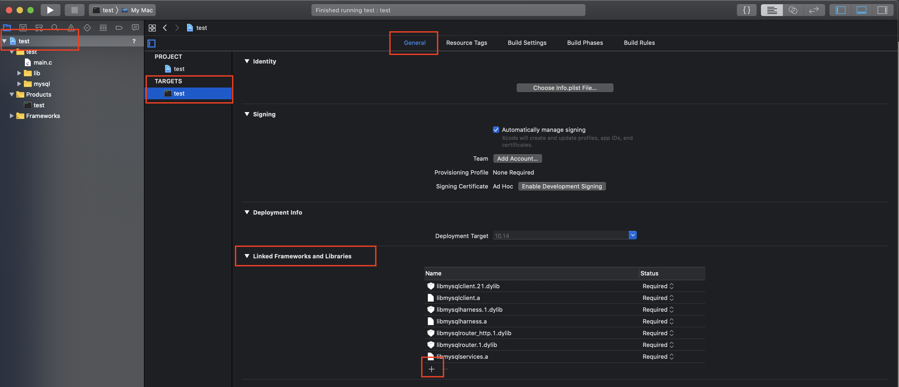

# Xcode\_头文件\_静动态库\_编译输出位置

## Xcode_头文件_静动态库\_编译输出位置

**xcode 项目中, 各种位置的设置, \(完全可以使用,支持版本 10.2.1\)**

## 头文件位置: 

    `项目设置 -> PROJECT -> Build Settings -> All[Combined] -> Search Paths -> Header Search Paths 或者 User Header Search Paths` 

**\(Header Search Paths: 添加\#include  的路径, User Header Search Paths: 添加\#include "x.h" 路径 \)**

## 静态库位置 

`项目设置 -> TARGETS -> 生成应用名称 -> General -> Linked Frameworks and Libraries`  
**\( 在这里添加批量添加静态库文件, 点击加号, 在弹出框内 再点击 Add Other... ,选择静态库文件就行 \)**

## 动态库位置

`项目设置 -> TARGETS -> 生成应用名称 -> Build Settings -> All[Combined] -> Search Paths -> Library Search Path`  
**\( 在选项内添加 动态库 所在的路径, 已有的内容不要删 \)**

## 编译输出位置

`项目设置 -> TARGETS -> 生成应用名称 -> Build Settings -> All[Combined] -> Build Locations -> Per-configuration Build Produtes Path` 

\( **将选项内的 第一个$ 之前的内容修改为 路径就行 , 范例:** /Users/ns/Xcode/test/test/$\(CONFIGURATION\)$\(EFFECTIVE\_PLATFORM\_NAME\)**\)**

